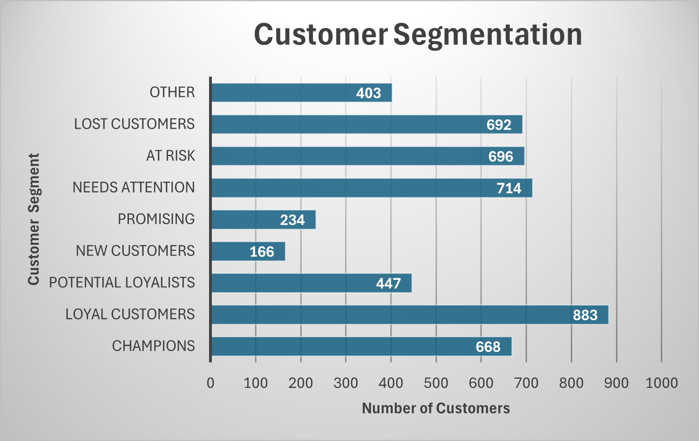
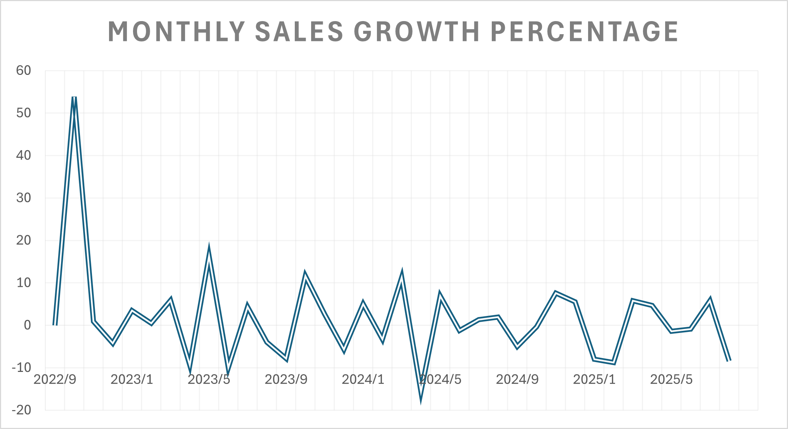

# SQL Customer Analytics for Einfach Online GmbH
An End-to-End E-commerce Data Analysis Project

## Project Overview
This project is a comprehensive, end-to-end analysis of customer purchasing behavior for **Einfach Online GmbH**, a fictional German e-commerce platform specializing in sustainable products. The goal was to move beyond intuition-based decisions and leverage customer data to answer critical business questions, ultimately providing actionable recommendations to drive growth and improve customer retention.

The entire analysis, from data cleaning and aggregation to complex customer segmentation, was conducted using SQL.

## Key Business Questions
This analysis was guided by a desire to understand our customers and product performance on a deeper level:

1. **Customer Value**: Who are our most valuable customers based on their purchase history?

2. **Product Performance**: What are our best-selling products and categories? Are there opportunities for product bundling?

3. **Geographic Trends**: How does customer behavior vary across different cities in Germany?

4. **Customer Lifecycle**: What is the typical purchasing cycle, and can we identify customers who are at risk of churning?

5. **Marketing Impact**: How effective have our past marketing campaigns been?

## Data Source & Schema
The dataset was *synthetically generated* to model a realistic e-commerce business. It consists of five interconnected tables, which were loaded into a **PostgreSQL** database.

- `customers`: Contains information on 5,000 customers.

- `products`: Details on 100 unique, sustainable products.

- `orders`: Records of 20,000 unique orders.

- `order_items`: The bridge table detailing the contents of each order.

- `marketing`: Information on promotional campaigns.

## Tools & Technologies

- **Data Generation**: Python (Pandas, Faker)

- **Database**: PostgreSQL

- **Analysis**: SQL (using advanced techniques like CTEs, Window Functions, Joins, and Subqueries)

- **Visualization**: Microsoft Excel, Tableau

- **Version Control**: Git & GitHub

## Key Findings & Visualizations

### Finding 1: Key Customer Segments Require Strategic Focus

The RFM (Recency, Frequency, Monetary) analysis successfully segmented customers into distinct groups. While "Loyal Customers" form the largest group (18.01%), our most valuable "Champions" make up a significant 13.62% of the customer base.
Here are some of the core insights derived from the SQL analysis.

Critically, the "Needs Attention," "At Risk," and "Lost Customers" segments combined represent over 43% of all customers. This highlights a major opportunity for targeted re-engagement campaigns to prevent churn and recover lost revenue.

### Finding 2: Monthly Sales Trends

The average monthly sales growth over the entire period (September 2022 to August 2025) is 2.59%. While this is a positive average, the high number of months with negative growth (15 out of 36) suggests that the company struggles with consistent positive momentum. The major gains are often offset by subsequent declines.

A year-over-year comparison shows that 2024 performed better than 2023, with a total growth of 15.46% compared to 12.44% in 2023. This suggests a slight improvement in overall sales performance, despite the continued volatility. The year 2025, however, appears to be on a weaker trend, with a negative cumulative growth of -12.87% as of August. This indicates a potential downturn in the most recent period.

-------------------------------
#### [Tableu Dashboard](https://public.tableau.com/views/E-CommerceDataAnalysis_17621794252210/Dashboard1?:language=en-US&:sid=&:redirect=auth&:display_count=n&:origin=viz_share_link)

## Actionable Recommendations

Based on the analysis, I recommend the following data-driven strategies for Einfach Online GmbH:

### 1. Launch a Loyalty Program for "Champions" & "Loyal Customers": 

Given that our "Champions" (13.62%) and "Loyal Customers" (18.01%) are our most valuable segments, we must focus on retaining them. I propose creating a tiered loyalty program that offers exclusive perks like early access to new products and free shipping.

### 2. Re-engage Over 43% of Customers with Targeted Campaigns: 

For customers in the "At Risk", "Needs Attention" and "Lost" segments, we must launch personalized "We Miss You!" email campaigns that offer a time-sensitive discount to incentivize their return and prevent further churn.

### 3. Create Strategic Product Bundles: 

To increase the Average Order Value (AOV), we should bundle frequently co-purchased items. 

## How to Run This Project

#### 1. Set up the Database: 

Create a PostgreSQL database and use the `CREATE TABLE` statements found in `/sql_scripts/00_create_schema.sql` (you should create this file from your project plan).

#### 2. Load the Data: 

Use the CSV files located in the `/data` directory to populate the tables.

#### 3. Run the Analysis: 
The SQL queries for each of the 10 analytical tasks are provided as separate, commented files in the `/sql_scripts folder`. They are numbered in the recommended order of execution.

### Connecting to My Background

"My background in physics and numerical modeling trained me to approach complex systems by forming a hypothesis, designing an experiment to test it, and rigorously analyzing the results. I applied this same scientific method to a business problem in my e-commerce project. The business questions were my hypotheses. The SQL queries were my experiments to extract and structure the necessary data. The final analysis and data visualizations were my interpretation of the results, which I translated into concrete business recommendations. This project demonstrates my ability to use technical tools like SQL not just to query data, but to systematically solve problems and create value.

Amos Ram Rehum
